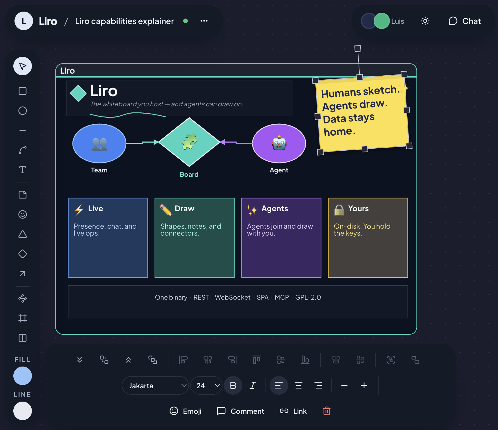

# Liro



Liro is a self-hosted collaborative whiteboard. 

**Current release:** see [`VERSIONS`](VERSIONS) · **changes:** [`CHANGELOG.md`](CHANGELOG.md) · **license:** [GPL-2.0](LICENSE)

## Features

- Real-time multi-user boards (WebSocket sync)
- Shapes, sticky notes, text, stickers, frames, lanes, groups, and freeform paths
- Visio-like Orthogonal connectors with side ports
- Board passwords, archive/restore, and import/export
- MCP tools at `/mcp` for agent-driven sketching and layout

## Requirements

- To **run** a release binary or Docker image: nothing else
- To **build from source**: Go **1.25+** and Node.js **22+** (see `go.mod` and `VERSIONS`)
- Optional: Docker

## Quick start

One binary serves the API, WebSocket, MCP, and the UI. Open `http://127.0.0.1:8080`. Board data lives in `./data` by default (`LIRO_DATA`).

### Prebuilt binary

Download a multi-arch binary from the GitHub Releases page for the version in [`VERSIONS`](VERSIONS). Each push to `main` on the GitHub mirror creates or replaces release `vX.Y.Z` (same version → substituted assets).

```bash
./liro
```

No Node.js and no `web/dist` directory — the SPA is compiled into the binary.

### Build from source

```bash
make deps
make build   # Vite SPA → embed → bin/liro
./bin/liro
```

### Docker

```bash
make docker-run
# equivalent:
# docker build -t liro .
# docker run --rm -p 8080:8080 -v liro-data:/data liro
```

The image binary embeds the SPA (no separate static volume).

### Development (API + Vite HMR)

```bash
make deps
make dev
```

- API: `http://127.0.0.1:8080`
- UI: `http://127.0.0.1:5173`

`make run` builds the SPA to `web/dist` and starts the Go server without writing `bin/liro`. If `web/dist` exists in the working directory, that copy is served instead of the embedded UI.

## Configuration

| Variable      | Default | Meaning |
|---------------|---------|---------|
| `LIRO_ADDR`   | `:8080` | Listen address |
| `LIRO_DATA`   | `data`  | On-disk board store |
| `LIRO_STATIC` | *(unset)* | Optional SPA directory override. If unset: use `web/dist` when present, otherwise the embedded UI. |

Makefile shortcuts: `ADDR`, `DATA` (exported as the `LIRO_*` vars above).

## MCP

With the server running, point an MCP client at `http://127.0.0.1:8080/mcp`. Agent workflow and tool notes live in [`internal/mcp/skill.md`](internal/mcp/skill.md).

## Development commands

| Command          | Purpose                         |
|------------------|---------------------------------|
| `make test`      | Go tests                        |
| `make lint`      | Frontend lint (oxlint)          |
| `make clean`     | Remove `bin/liro` and `web/dist`|

## License

Liro is free software: you can redistribute it and/or modify it under the terms of the **GNU General Public License as published by the Free Software Foundation; either version 2 of the License, or (at your option) any later version**.

See [`LICENSE`](LICENSE) for the full GPLv2 text.
